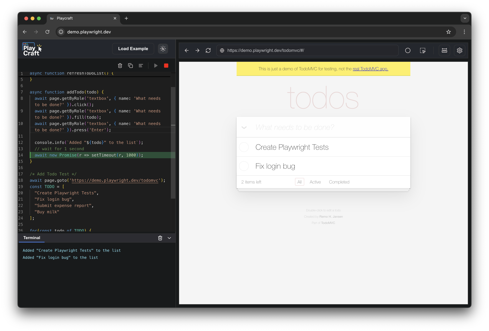

<div align="center">
   
  <p>
    <em>Visual Playwright IDE with live browser preview and real-time test execution</em>
  </p>
</div>


[](https://npmjs.com/package/playcraft)

## 🚀 Installation

Get started with Playcraft in seconds:

```bash
npm install -g playcraft
```

## 🎯 Quick Start

Once installed, launch Playcraft from any directory:

```bash
playcraft
```


